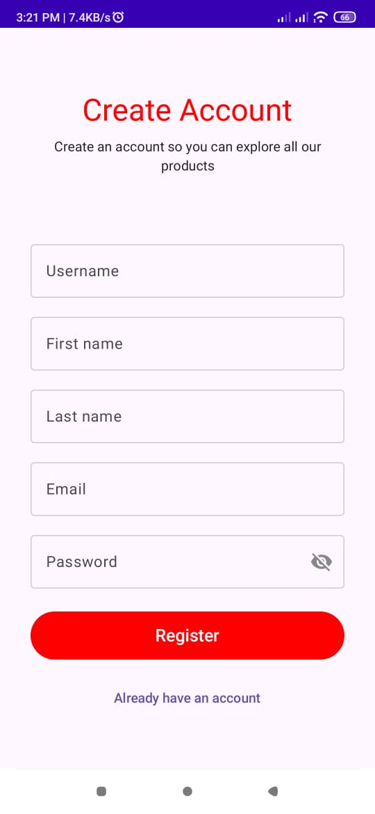
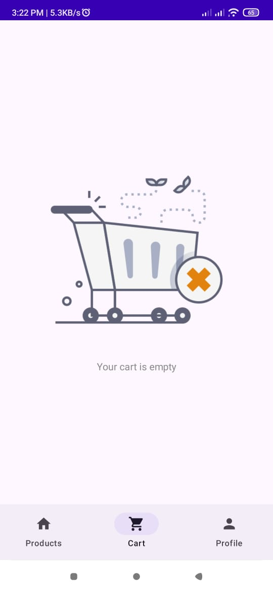
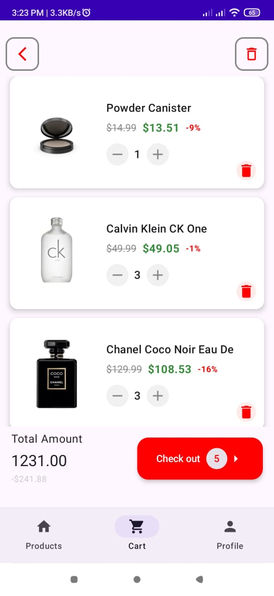
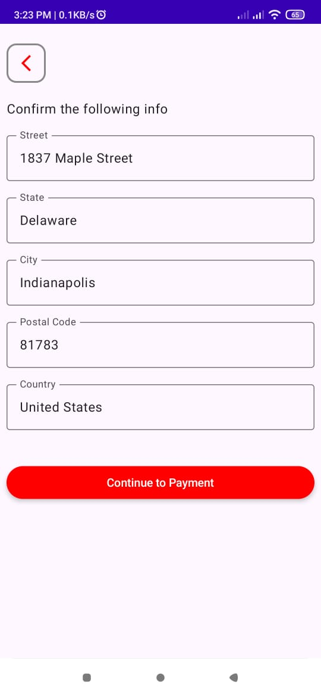
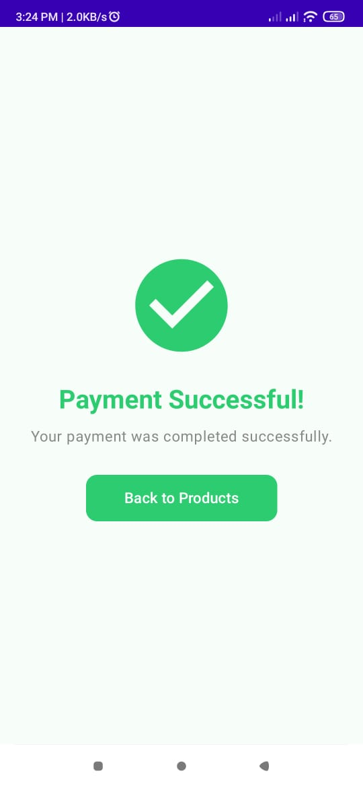
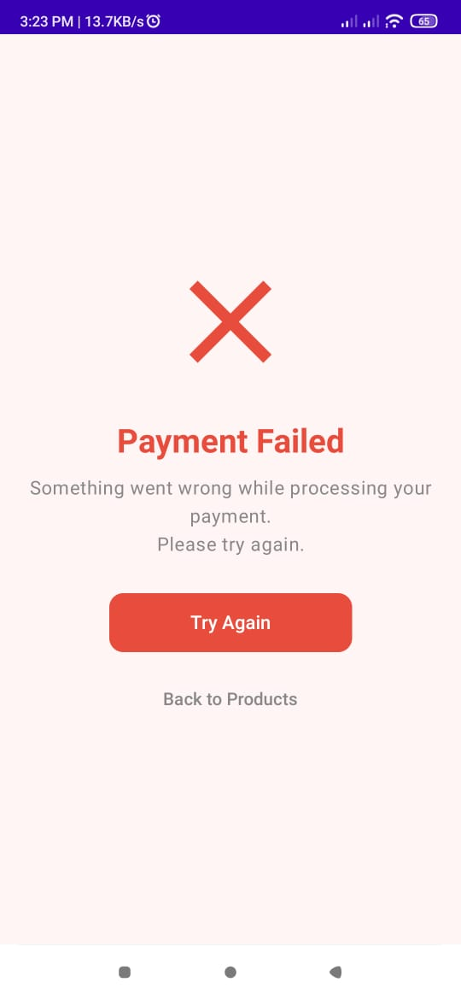
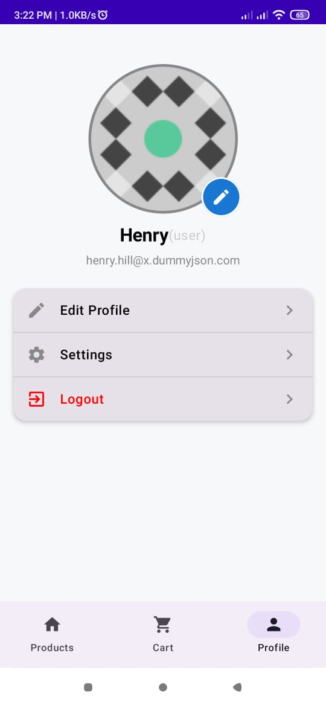

# **DemoShoppingApp**

A **demo Android shopping app** built with **Jetpack Compose** that integrates **Stripe** for secure payments.  
The app is backed by a **Spring Boot** server, which provides the **client secret** required for confirming payments via Stripe.  

---

## **Features**

### **Shopping Functionality**  
- **Browse Products** → View a list of available products with details.  
- **Product Details** → See full information, price, and description.  
- **Add to Cart** → Add items to your personal shopping cart.  
- **Update Cart** → Increase or decrease product quantities.  
- **Remove from Cart** → Delete products from your cart.

### **Stripe Payment Integration**  
- Integrated **Stripe SDK** for smooth and secure online payments.  
- **Spring Boot backend** is used to create **Payment Intents** and return the **client secret** to the app.  
- Supports **credit/debit card payments** using Stripe’s **CardInputWidget** or a custom card entry UI.  
- **Billing Address Form** is auto-filled using the **user profile** but can also be edited before checkout.  
- **Payment Status Handling**:
  - **Payment Success** → Navigate to a success screen.
  - **Payment Failed** → Show a failed payment screen.
  - **Payment Canceled** → Properly handle canceled payments.

### **User Authentication & Profile**  
- **Sign Up / Register** → Create a new account.  
- **Login** → Authenticate and access personalized data.  
- **User Profile** → Stores user information including name, email, and billing address for quick checkout.  

### **Cart & Checkout Flow**  
- View the cart at any time.  
- Update quantities or remove items.
- Delete the entire cart.    
- Click **Checkout** to confirm your billing details and complete payment securely.  

---

## **Architecture**

The app follows **MVVM architecture** with the following layers:  
- **UI Layer** → Built with **Jetpack Compose**.  
- **ViewModel Layer** → Manages UI state and interacts with repositories.  
- **Repository Layer** → Handles API calls and data operations.  
- **Backend** → A **Spring Boot** server that:
  - Creates **PaymentIntent** using Stripe's API.
  - Returns the **client secret** to the Android app.
  
---

## **Tech Stack**

### **Frontend (Android App)**  
- **Language:** Kotlin  
- **UI Framework:** Jetpack Compose  
- **Navigation:** Jetpack Navigation Component  
- **Payment SDK:** [Stripe Android SDK](https://stripe.com/docs/payments/accept-a-payment?platform=android)  
- **Networking:** Retrofit + Coroutines  
- **State Management:** ViewModel + LiveData / StateFlow  

### **Backend (Spring Boot App)**  
- **Framework:** Spring Boot  
- **Payment API:** Stripe Java SDK  
- **Endpoints:**
  - `POST /create-payment-intent` → Generates a PaymentIntent and returns the **client secret**.  

---

## **Screenshots**
- Login and Register screens

- Product Listing Screen  

- Product Preview Screen

- Cart Screen

- Checkout/Billing Screen  

- Payment Success & Failed Screens
  

- Profile screen 

---

## **How It Works** 🔗  

1. User selects products and adds them to the cart.  
2. At checkout, the app requests a **PaymentIntent** from the **Spring Boot** backend.  
3. The backend calls **Stripe API** to create the PaymentIntent and sends the **client secret** to the app.  
4. The app uses **Stripe’s PaymentLauncher** to confirm the payment.  
5. The user is redirected to:
   - **Success screen** if payment succeeds.  
   - **Failed screen** if payment fails.  

---

## **Future Improvements**
- Add order history and receipts.  
- Support multiple payment methods (Apple Pay, Google Pay, etc.).  
- Improve UI with animations and better product visuals.  
- Implement push notifications for order updates.
- implementing a real API instead of the dummy json API

---
